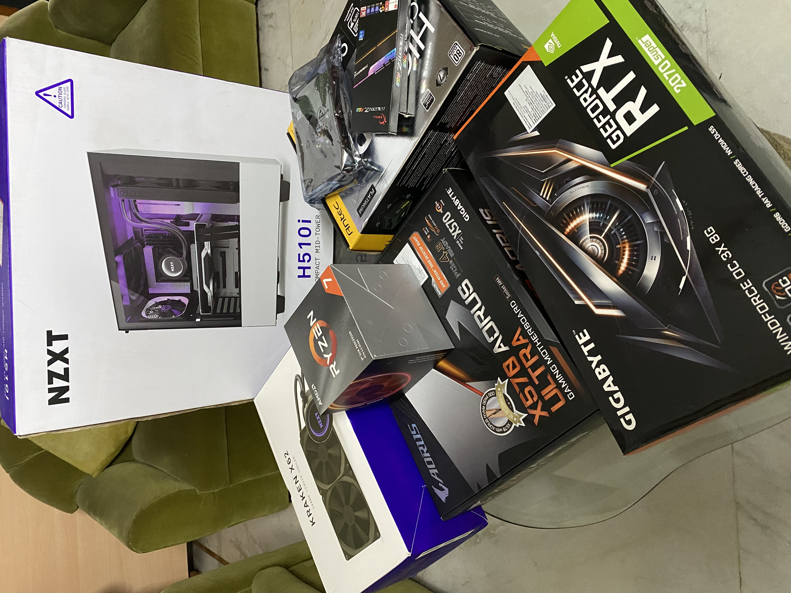

## Introducing Prometheus

> "In Greek mythology, Prometheus, meaning "forethought") is a Titan, culture hero, and trickster figure who is credited with the creation of humanity from clay, and who defies the gods by stealing fire and giving it to humanity as civilization. Prometheus is known for his intelligence and as a champion of humankind and also seen as the author of the human arts and sciences generally."

## Why own a Deep Learning workstation?

Today, there are a myriad of cloud GPU instances one can use to dabble in the field of deep learning. Over the past year or so, I have used almost all the possible options available which has helped me grasp the concepts of the field as it has made it easy fro anyone to prototype the knowledge acquired in the field at an affordable cost. Most of these services also offer free tier options and provide **almost** immediate access to a GPU instance. 

My overall favourite has been Google's GCP which also provides a 300$ credit to all their users as well as the newly launched Colab Pro which in my opinion is the best value for money option for most DL enthusiasts as it gives you access to multiple GPU instances for a nomianl monthly fee. GCP's main advantage is full command line access to your linux based server whereas Colab's interface is quite intutive as well. Until recently, I had opted for the Colab Pro for most of my prototyping and finally renting a GCP instance to train large models on a hourly basis as required. 

This being said, there are still dowsides to this setup which becomes way too evident as you start spending longer time using a setup mentioned above which I'm sure anyone in the field long enough can easily vouch for. Despite the fact that gaining access to a GPU instance has become way too easy, here the major downsides which has bugged me long enough in order to shell out and invest in building my own DL rig:

* The setup process of getting your instance started with the correct requirements can be quite tedious and takes some time to get a hang of things in each cloud platform available. 
* Pre-emptible instances, which are the free-tier option provided by cloud services can get really annoying as you can be kicked off the instance abruptly in the middle of your training process.
* On the other hand, the constant worry to ensure shutting down your device to avoid racking up the bill is definitely real. 

In short, having your workstation at hand gives you the much needed freedom to prototype models at the flick of your fingers and gets rid of all the friction involved in using the cloud options available. This is an extension to James Clear's advice 'make it easy' which is basically to eliminate the friction involved in performing long-term rewarding habits. 

>“Human behaviour follows the Law of Least Effort. Reduce the friction associated with good habits. When friction is low, habits are easy.”
― James Clear

---
## Should you build your own workstation?

Due to my lack of experience with hardware components and having not built a PC till now, I was definitely nervous to build my own own rig without the help of people with experience. There are many dealers and companies that provide services of building  DL workstation either as a fixed option or also provide customizing your options. 

Starting out, I was certain that this was the right choice considering that the parts are quite expensive and its natural to feel nervous that you might fry a component and thus waste loads of money. So, I started out researching all the components needed to build a decent DL workstation. Here again, I would like to point back to another Tim Dettmers blog, [A Full Hardware Guide to Deep Learning](https://timdettmers.com/2018/12/16/deep-learning-hardware-guide/), which shaped my though process in building Prometheus. 

This was followed by endless hours of watching various PC builds on YouTube and learning more and more about the fascinating hobby of PC building. These hours spent watching people such jaw-dropping builds motiavted be so much in wanting to build my own PC and the more I saw, the less daunting the whole task seemed. I highly recommend watching builds based on the components you decide specifically by [Linus Tech Tips](https://www.youtube.com/user/LinusTechTips), [Jays Two Cents](https://www.youtube.com/user/Jayztwocents) and [BitWit](https://www.youtube.com/user/AwesomeSauceNews). 

If you would like an all-in-one resource to build a PC based on the components needed to build a DL worksation like mine, this is the only one you'll probably need:
[How to Build a PC! Step-by-step](https://www.youtube.com/watch?v=IhX0fOUYd8Q) by [BitWit](https://www.youtube.com/user/AwesomeSauceNews). 

In hindsight, I can confidently say that building my own rig has been a wonderful learning experience that I am glad I did. Despite ones fears, it is worth pointing out that the process despite seeming pretty intimidating is quite easy if one follows the right guides. The components involved in building the PC are deinitely expensive and touted as quite delicate but in all fairness all the parts available today are quite rugged and one can dispel unnecessary fears of damaging them. Having built the entire system on my own, I have full control on any future expansion plans I have on this build and know exactly what the process is. I'm definitely another in the long line of individuals who would like to take PC building as a valuable hobby. 

This being said, If you're the type of person who doesn't envy this process and don't want to deal with the hassle of building your machine, I would suggest checking out [Ant-PC](https://www.ant-pc.com/ai-and-deep-learning) who provide customizable builds specific to deep learning and also provide ons-site warranty and they thoroughly stress test their parts before shipping for an affordable premium cost in comparison.  

---
## Components

---
### GPU

Arguably the most important component nowadays in a PC build, it is especially important for my use case since almost all the heavy lifting of training an ML model nowadays is done by it. It comprises of almost 50% of the overall cost of teh build and thus deciding this component is definitely one of the most importamt aspect to building any deep learning rig. 

My insight into choosing the GPU is heavily shaped by Tim Dettmers blog [post](https://timdettmers.com/2019/04/03/which-gpu-for-deep-learning/) where he compares the price to performance of the latest NVIDIA cards. 

In the blog post which is a little dated today, he recommends the RTX 2070 as the sweet spot in terms of cost-efficiency and  performance. But since the release of the 20 series RTX Super cards which provide much better prefomance for mot much a difference, I opted for the RTX 2070 Super and specifically chose Gigabyte's RTX 2070 Super Windforce OC, which is highly regarded as one of the best cost efficient GPU in the market today. 

The recent NVIDIA cards since the 1080 Ti offer the possibility of training DL models at half-precision points i.e. allow the possibilty of training in FP16 over full precision training at FP32 which has been vital for training large models much quicker and lowering the GPU RAM usage since in theory this type of training doubles the GPU RAM at your disposal. 

I would have loved to opt for the RTX 2080 Ti but in all honesty couldn't fathom and justify the price difference between the two. I have developed my build in such a way that it can suport a multiple GPU system, so maybe down the road ;).

---
### CPU and Motherboard

### RAM

RAM Clock Speed and RAM Latency

The memory timings are given through a series of numbers; for instance, 4-4-4-8, 5-5-5-15, 7-7-7-21, or 9-9-9-24. These numbers indicate the amount of clock cycles that it takes the memory to perform a certain operation. The smaller the number, the faster the memory.

### CPU Cooler

### Storage

### Cabinet

